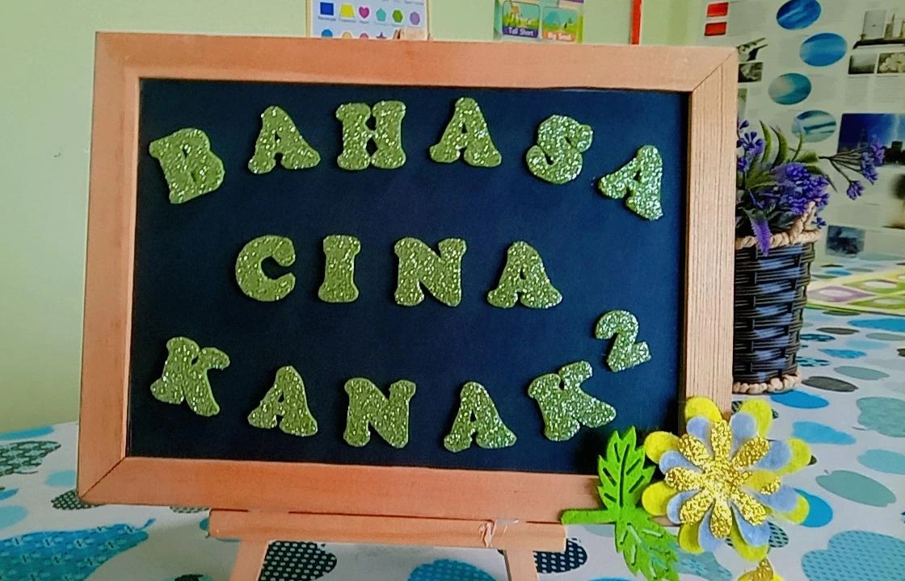

# PPAPP 360° Virtual Tour


A 360° Virtual Tour web application built for the **Perbadanan Perpustakaan Awam Pulau Pinang (PPAPP)**. This interactive experience allows users to explore various PPAPP library branches virtually through high-resolution panoramic images, interactive hotspots, rich media markers, and audio narration.

🌐 **[Live Demo / GitHub Pages](https://aplikasi-perpustakaan.github.io/PPAPP-360-Virtual-Tour/)**

---

## 📖 Table of Contents

- [Features](#-features)
- [Architecture & Tech Stack](#-architecture--tech-stack)
- [Library Branches](#-library-branches)
- [Project Structure](#-project-structure)
- [Development Setup](#-development-setup)
- [URL Parameters & Debugging](#-url-parameters--debugging)
- [Adding New Locations](#-adding-new-locations)
- [Thumbnail Generation](#-thumbnail-generation)
- [Custom Markers](#-custom-markers)
- [Deployment](#-deployment)
- [Contributing](#-contributing)

---

## ✨ Features

- **Immersive 360° Panoramas**: High-quality 2:1 equirectangular projections (minimum 4096×2048, recommended 8192×4096).
- **Smooth Intro Sweep Animation**: Automatic 360° rotation sweep (3 RPM) on initial app load and upon switching branches.
- **Interactive Navigation**: Directional arrows and hotspots allowing users to walk seamlessly between scenes and floors.
- **Rich Media & Custom Markers**:
  - Standard information panels and audio markers.
  - Interactive `<custom-marker>` Web Components featuring ripple animations and 3D bounce tooltips with slotted images and text.
- **Multi-Branch Switching**: Dynamic loading of branch chunks on demand with a glassmorphism loading overlay.
- **Sphere Correction**: Support for fine-tuned `pan`, `tilt`, and `roll` rotation adjustments per scene to guarantee level horizons and accurate bearings.
- **No Build Step**: Native ES Modules loaded via browser `<script type="importmap">` (no Node.js, Webpack, or Vite bundling required).
- **Responsive Theme**: Dark Moody Blue/Grey glassmorphic UI styled with CSS custom properties.
- **Kiosk & Debug Modes**: Dedicated flags for public exhibition kiosks and coordinate calibration overlays.

---

## 🛠 Architecture & Tech Stack

- **Frontend**: Native HTML5, CSS3 (using CSS custom properties), and JavaScript (ES2022+ modules).
- **Module System**: Browser-native ES Modules resolved via `<script type="importmap">` from CDNs.
- **Viewer Core**: [Photo Sphere Viewer (PSV v5)](https://photo-sphere-viewer.js.org/) and Three.js.
  - `@photo-sphere-viewer/virtual-tour-plugin`
  - `@photo-sphere-viewer/markers-plugin`
  - `@photo-sphere-viewer/gallery-plugin`
  - `@photo-sphere-viewer/compass-plugin`
  - `@photo-sphere-viewer/map-plugin`
  - `@photo-sphere-viewer/autorotate-plugin`
- **Hosting**: Completely static. Compatible with GitHub Pages, Apache (`.htaccess` included), and IIS (`web.config` included).

---

## 🏛 Library Branches

| Code | Full Name | Status | Coverage Highlights |
| :--- | :--- | :--- | :--- |
| `pusat` | PUSAT – Seberang Jaya (HQ) | In Progress | Headquarters central facility |
| `bt` | Cawangan Daerah Seberang Perai Utara | Active | Multi-floor tour (Exterior, Lobby, Kids, Surau, Ramp, Front/Back Stairs, TYT Gallery, Reading Hall) |
| `jw` | Cawangan Daerah Seberang Perai Selatan | Active | Multi-floor tour (Exterior, Lobby, Kids, Stairs, E-Sport, Facilities, Reference Hall) |
| `bm` | Cawangan Daerah Seberang Perai Tengah | Active | 19 scenes (Entrance Steps, Verandah & Signboard, Porch, Service Counter, Reading Stacks, Kids Activity Area, Bahagian Kanak-Kanak) |
| `ppaj` | PP AEON Jusco Alma | Active | 10 scenes (Level 1 Main Area, Collections, Reading Spaces) |
| `gt` | Cawangan Daerah Timur Laut | Planned | Branch expansion |
| `ppk` | PP Lounge@Komtar | Planned | Branch expansion |

---

## 📁 Project Structure

```text
PPAPP-360-Virtual-Tour/
├── index.html                  # Main application entry point & import map
├── main.js                     # Bootstrap, viewer init, branch startup & intro sweep
├── style.css                   # Global styles & CSS custom properties (Dark theme)
├── favicon.png                 # PPAPP official browser favicon
├── js/                         # Core ES modules (kebab-case)
│   ├── custom-marker.js        # Web Component for interactive ripple markers & cards
│   ├── loading-screen.js       # Glassmorphism loading screen management
│   ├── location-selector.js    # Branch selection dropdown handler & transitions
│   ├── marker-templates.js     # Helper functions for standard info/audio markers
│   ├── coordinate-logger.js    # Utility for logging click yaw/pitch coordinates
│   └── audio-controller.js     # Background and narration audio handlers
├── locations/                  # Modular scene definitions per branch
│   ├── bm/                     # Bukit Mertajam (bm-index.js, bm-ext-outside.js, etc.)
│   ├── bt/                     # Seberang Perai Utara (bt-index.js, bt-f1-*.js, etc.)
│   ├── jw/                     # Seberang Perai Selatan (jw-index.js, jw-*.js, etc.)
│   ├── ppaj/                   # AEON Jusco Alma (ppaj-index.js, ppaj-f1-main-area.js)
│   └── pusat/, gt/, ppk/       # Additional branch modules
├── images/                     # Panoramas and thumbnails
│   ├── shared/                 # Common assets (logos, placeholder.jpg, favicon)
│   ├── bm/                     # BM panoramas & thumbs/ (ext-outside, gf-lobby, etc.)
│   ├── bt/                     # BT panoramas & thumbs/
│   ├── jw/                     # JW panoramas & thumbs/
│   └── ppaj/                   # PPAJ panoramas & thumbs/
├── scripts/                    # Maintenance & automation tools
│   └── generate-thumbnails.py  # Script for generating flat rectilinear 2D thumbnails
├── docs/                       # Developer documentation & reference guides
│   ├── NAVIGATION_LINKS_GUIDE.md
│   ├── PSV_REFERENCE.md
│   └── PSV_DEMOS_REFERENCE.md
├── web.config                  # IIS static MIME types & caching rules
└── .htaccess                   # Apache static configuration
```

---

## 🚀 Development Setup

Because this project uses native ES Modules, files must be served over HTTP rather than opened directly via `file://`.

1. **Clone the repository**:
   ```bash
   git clone https://github.com/aplikasi-perpustakaan/PPAPP-360-Virtual-Tour.git
   cd PPAPP-360-Virtual-Tour
   ```

2. **Start the local dev server** (with auto-saving enabled):
   - **Using npm / Node.js** (Recommended):
     ```bash
     npm start
     # or: node dev_server.js
     ```
   - **On Windows (Double-click launcher)**:
     Double-click `open_tour.bat`.
   - **VS Code**:
     Press `F5` (or click "Run and Debug"). It automatically starts the dev server and opens the browser.
   - **Python fallback** (read-only mode, no auto-save):
     ```bash
     python -m http.server 8080
     ```

3. **Open in Browser**:
   Navigate to `http://localhost:8000`.

---

## 🕹 URL Parameters & Debugging

The application supports various URL query parameters for development, direct linking, and exhibition setups:

| Parameter | Example | Purpose |
|---|---|---|
| `node` | `?node=bm-ext-outside-1` | Jump directly to a specific scene ID on startup. |
| `yaw`, `pitch` | `?yaw=90deg&pitch=-5deg` | Override initial camera heading and pitch. |
| `pan`, `tilt`, `roll` | `?pan=5deg&tilt=2deg&roll=0deg` | Override scene sphere correction angles. |
| `debug` | `?debug=true` | Shows visual center crosshair, gridlines, and enables coordinate logging. |
| `kiosk` | `?kiosk=true` | Kiosk display mode (hides navigation controls and dropdowns for public terminals). |

---

## 🗺 Adding New Locations

1. **Place Panorama Images**:
   Store 2:1 equirectangular `.jpg` files in `images/{branch}/{section}/{branch}-{section}-{N}.jpg`.

2. **Generate Flat Perspective Thumbnails**:
   Every scene **must** have a rectilinear thumbnail in `thumbs/`:
   ```bash
   python scripts/generate-thumbnails.py --branch {branch} --update-scenes
   ```

3. **Define Section Module**:
   Create or edit `locations/{branch}/{branch}-{section}.js`:
   ```javascript
   export default [
     {
       id: 'bm-gf-lobby-1',
       name: 'Ground Floor – Entrance & Service Counter',
       caption: 'BM – Ground Floor – Entrance & Service Counter',
       panorama: './images/bm/gf-lobby/bm-gf-lobby-1.jpg',
       thumbnail: './images/bm/gf-lobby/thumbs/bm-gf-lobby-1.jpg',
       defaultYaw: '15deg',
       defaultPitch: '0deg',
       sphereCorrection: { pan: '0deg', tilt: '0deg', roll: '0deg' },
       links: [
         {
           nodeId: 'bm-gf-lobby-2',
           position: { yaw: '15deg', pitch: '-5deg' },
           name: 'Go to Main Lobby & Aisle',
         },
       ],
       markers: [],
       data: {
         floor: 'gf',
         tags: ['lobby', 'counter', 'entrance'],
       },
     },
   ];
   ```

4. **Register in Branch Index**:
   Export the section in `locations/{branch}/{branch}-index.js`:
   ```javascript
   import bmGfLobbySection from './bm-gf-lobby.js';

   export default [
     ...bmGfLobbySection,
   ];
   ```

---

## 🖼 Thumbnail Generation

The project strictly requires flat perspective (rectilinear) thumbnails extracted from the equirectangular panoramas:
- **Dimensions**: 400 × 300 px
- **Quality**: 80% JPEG
- **Path**: `images/{branch}/{section}/thumbs/{filename}.jpg`

To regenerate or create thumbnails automatically:
```bash
python scripts/generate-thumbnails.py --branch bm --update-scenes
```

---

## 📍 Custom Markers

The project features a custom Web Component `<custom-marker>` ([js/custom-marker.js](js/custom-marker.js)) that provides an animated pulsing button and an interactive floating card:

```javascript
import '../../js/custom-marker.js';

markers: [
  {
    id: 'bm-gf-kids-8-custom-img',
    position: { yaw: '91.17deg', pitch: '-23.31deg' },
    element: (() => {
      const el = document.createElement('custom-marker');
      el.innerHTML = `
        
        <h2>Children's Corner</h2>
        <p>Bahasa Cina Kanak-Kanak Collection</p>
      `;
      return el;
    })(),
    anchor: 'center center',
  }
]
```

---

## ☁️ Deployment

- **GitHub Pages**: Pushes to `main` trigger deployment if configured in repository settings.
- **IIS**: `web.config` ensures `.json`, `.js`, and `.jpg` MIME types are served correctly with proper caching headers.
- **Apache**: `.htaccess` enables MIME types, CORS headers, and browser caching.

---

## 🤝 Contributing & Guidelines

- **Native ES Modules Only**: Do not use CommonJS (`require`). Use standard `import` / `export`.
- **Thumbnails**: Never link raw panoramas in `thumbnail:` fields; always point to the generated `thumbs/` image.
- **Bi-directional Navigation**: When linking scene A to B, always provide a return link from B to A to prevent user traps.
